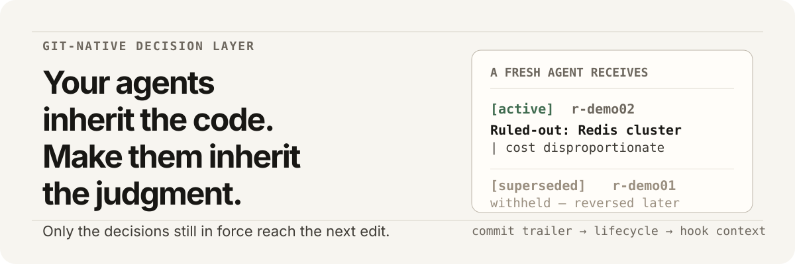

<p align="center">
  
</p>

<p align="center">
  <a href="https://github.com/MongLong0214/commitlore/actions/workflows/ci.yml"></a>
  <a href="LICENSE"></a>
  <a href="package.json"></a>
</p>

<p align="center">
  <a href="README.md">English</a> · <a href="README.ko.md">한국어</a> · <a href="README.ja.md">日本語</a> · <strong>简体中文</strong>
</p>

# CommitLore

**你的编程代理不断重新提议团队早已否决的方案。**

CommitLore 把这些决策保存在 Git 中，并在它编辑文件之前，把仍然有效的决策交给它。

CommitLore 没有托管服务；它把 record 保存在 Git 中。其 MCP 服务器或 hook 返回
上下文后，host 会按自己的政策处理这些上下文；CommitLore 无法控制那条数据流。

**两半之中只有一半是自动的。** *delivery* —— 在代理编辑某个路径之前把仍然有效的
决策交给它 —— 安装后即自动进行。*capture* —— 记录新的决策 —— 由代理在变更带有
diff 无法展示的理由时执行。普通的 `git commit` 无法启动它：hook 拿到的是 diff，
而 capture 需要会话。

<p align="center">
  
</p>

<details>
<summary><strong>目录</strong></summary>

- [安装](#安装)
- [代理收到的内容](#看它实际运行)
- [哪些是自动的，哪些不是](#哪些是自动的哪些不是)
- [这在什么情况下帮不上忙](#这在什么情况下帮不上忙)
- [一个例子中的问题](#代码留了下来决定没有)
- [完整地说，它是什么](#完整地说它是什么)
- [查看路径查询](#查看路径查询)
- [这个仓库本身就是演示](#这个仓库本身就是演示)
- [路径范围与检索](#检索能找到记录路径范围会排除已经推翻的决策)
- [工作方式](#工作方式)
- [来自另一仓库的现场报告](#在真实仓库中的样子)
- [有何不同](#有何不同)
- [在哪里见效](#在哪里见效)
- [record 如何创建](#record-如何创建)
- [完整 record](#完整-record)
- [仓库能够证明什么](#仓库能够证明什么)
- [证据](#evidence更窄的产品主张)
- [卸载](#卸载) · [文档](#文档) · [贡献](#贡献)

</details>

## 安装

安装一次。装好 host integration，并初始化要使用的仓库。

**Claude Code** — 一个插件即可注册 MCP 服务器、编辑前上下文钩子与技能:

```
/plugin marketplace add MongLong0214/commitlore
/plugin install commitlore@commitlore
```

插件所含仅此而已：MCP 服务器、编辑前钩子与技能。它不会把 `commitlore` 放到 `PATH` 上，因此下面的 `commitlore …` 命令来自 `install.sh` / `install.ps1`，还需要那一步安装。

**Codex** — 原生插件只需一条命令即可安装:

```bash
commitlore plugin install-codex
```

它通过 Codex 自己的 CLI 注册 marketplace 与 plugin，绝不直接修改其配置或缓存。下面的标准安装脚本在检测到 Codex 时也会执行同一条命令。安装后请开启新的 Codex session —— plugin 的 skill 与 MCP server 在 session 启动时加载，而不是在安装时。下面的 CLI 提供 repository 命令。

两条路径的前置条件都是 Node.js 22.23.2+ 与 Git。脚本在写入任何内容之前会检查这两项。

**其他编程代理** — 安装 CLI:

```bash
curl -fsSL https://raw.githubusercontent.com/MongLong0214/commitlore/v1.1.1/install.sh | sh -s v1.1.1
```

**Windows** — 在 PowerShell 中执行同样的安装：

```powershell
& ([scriptblock]::Create((irm https://raw.githubusercontent.com/MongLong0214/commitlore/v1.1.1/install.ps1))) v1.1.1
```

在 Windows 上配置 host 需要 **v1.1.1 或更高版本**。在此之前，检测看不到 `.cmd` shim，安装器也无法运行它，因此 Windows 安装只放下 CLI 而不配置任何 host —— 报告为 `ok: false`，而不是成功。已在 1.1.1 上于真实机器验证 Codex、Gemini CLI 与 Hermes。

**Hermes** — 安装 CLI 后，配置它的 host integration：

```bash
commitlore hermes install
```

支持哪些 host，以及各条安装路径需要什么：[docs/COMPATIBILITY.md](docs/COMPATIBILITY.md)。

**把上一个代理挣得的判断，交给下一个代理。**

### 然后，在每个仓库中

然后在每个需要验证 hook、本地 index 与仓库自有 agent procedure 的仓库运行
`commitlore init`。安装程序会检测受支持的编程代理，并在可以安全处理的地方注册
本地 MCP server。

```bash
cd your-repository
commitlore init
commitlore context .
```

在那之后：

- 照常提交。绝大多数提交没有 record。
- 如果已有 record，commit-msg hook 会验证它；不会创建 record。
- delivery 与 capture 是不同 layer。下一节会准确说明每个 host 具备的两层。

继续通过编程代理工作。若某项更改包含 diff 无法保存的决策上下文，请让代理在提交中加入 CommitLore record。

<details>
<summary>想检查或固定安装版本？</summary>

这一行命令是为了方便。若需要经过审阅或固定版本的安装，请先下载并检查 `install.sh`，或 clone 仓库。脚本只安装一个固定标签的源码检出，以及一个运行 `node <checkout>/dist/commitlore.mjs` 的薄 wrapper —— 它不下载任何编译产物，也没有构建步骤，因此放到机器上的就是你能阅读的源码。

```bash
# 固定版本并检查 installer 后再执行。
curl -fsSLO https://raw.githubusercontent.com/MongLong0214/commitlore/v1.1.1/install.sh
sh install.sh v1.1.1

# 或者完全不用脚本：它创建的检出，你自己也能创建。
git clone --depth 1 --branch v1.1.1 https://github.com/MongLong0214/commitlore
node commitlore/dist/commitlore.mjs --version
```

</details>

## 看它实际运行

在编辑 `src/pricing.ts` 前，代理会收到这份 payload——record 本身，而不是对它的描述：

```
commitlore: active records for src/pricing.ts

Limit
  [claim]      r-price01  87e36511  calculatePrice owns final checkout pricing only

Ruled-out
  [claim]      r-price01  87e36511  Reuse checkout pricing for admin quotes | eligibility
                                    and rounding semantics differ between the two flows
```

`[claim]` 有实际含义：这条 record 的 author string 没有匹配仓库为 directive 配置的
字符串，所以代理会被告知把它当作信息权衡，而不是当作命令服从。默认 author-string
mode 的 `[directive]` 仅表示仓库决定将该字符串视为约束，并不证明身份；commit author
自己选择该字符串，任何能写入 commit 的人都可以伪造它。设置
`commitlore.requireSignedDirective=true` 后，还需要 Git 按验证者自己的 trust store
验证 signature，并要求 Git 报告的 `%GF` fingerprint 在 repository-local
`commitlore.trustedSigner` allowlist 中。allowlist 缺失、为空或不可读取时，任何人都不会被
授权。该 signature 同样不证明签名者有权指挥仓库，也不证明 record 的真实性。delivery 给代理
的是上下文，并不阻止编辑。

## 哪些是自动的，哪些不是

**Delivery** 表示 record 会在代理编辑 path 前到达。**Capture** 表示一项决定可以进入
经过验证的 commit-time flow。二者是不同的 layer：

| Host | Delivery | Capture |
|---|---|---|
| Claude Code | **有——通过 plugin 自动完成。** | **有——通过 plugin 提供。** |
| Codex | **有——通过 plugin 自动完成。** | **有——通过 plugin 提供。** |
| Hermes | **有——`commitlore hermes install`。** | **有——`commitlore hermes install`。** |
| Gemini CLI、Cursor、Windsurf、opencode | **是 —— 两个安装器都会配置 MCP server。** 它们并非各自实现，而是走同一个共享步骤。 | **是 procedure，不自动。** server 在每次连接时说明 prepare → verify → stage 流程。host 可能遵循，也可能不遵循。 |
| 其他遵循 `AGENTS.md` convention 的 host | **是 procedure，不自动。** `commitlore init --agents-md` 会写入 repository。 | **是 procedure，不自动。** 同一个文件，同样的前提。 |

“有”只表示该 layer 已安装，不表示每次 commit 都会得到 record。绝大多数 commit
本就不应携带 record。只有前三行会自动运行 integration。在其他 `AGENTS.md` host 上，
两步都是 instruction，而不是 hook。host 仍须启动 capture，candidate 也必须先通过
验证，commit hook 才会附加它。commit-msg hook 会验证已有的 record；它从不凭空创建 record。

## 这在什么情况下帮不上忙

请在安装前阅读，而不是之后。

- **测量的是较弱的那一档。** 在 1,160 次研究中，所有记录都渲染为 `[claim]`，
  它告诉代理把记录当作信息来权衡，而不是当作命令。`[directive]` 档位是在那之后
  才可达的，这里并未测量它 —— 研究自己的判定写道，这个数字"不会转移到更强的那一
  档"。directive 是更好、更差还是相同，**两个方向都没有测量**。
- **一个模型、一套 harness、十个构造的 fixture。** oracle 读取的是最终实现状态，
  因此它显示收到记录的代理更少重提被排除的方案，但并不显示其中任何一个读过什么。
- 尚未实现 cryptographic author verification、repository-wide record coverage、symbol anchor 和 interactive record builder：[#28](https://github.com/MongLong0214/commitlore/issues/28)、[#32](https://github.com/MongLong0214/commitlore/issues/32)、[#33](https://github.com/MongLong0214/commitlore/issues/33)、[#34](https://github.com/MongLong0214/commitlore/issues/34)。
- M4 没有检验 guard 效果：row 没有 `guard_exposure`，因而无法验证 treatment exposure（[#122](https://github.com/MongLong0214/commitlore/issues/122)）。
- Guard（ruled-out alternative matching）是实验性参考信息：precision 44.8%（95% Wilson CI 32.7%–57.5%），recall 22.0%，基于 417-decision corpus（[ADR-0020](docs/adr/ADR-0020-guard-is-an-experimental-advisory.md)）。空的 guard 结果不保证提案避开了所有 ruled-out alternative——在 recall 22% 下，遗漏才是常态。

完整方法、排除项与每个 arm 的 truncation split 见 [bench/VERDICT-M5.md](bench/VERDICT-M5.md)
及[它没有显示什么](docs/evidence.md)。delivery 方法和 retrieval 证据见
[bench/DECISION-DELIVERY.md](bench/DECISION-DELIVERY.md)。

## 代码留了下来，决定没有。

*不再重复评审同一个坏主意。*

**没有 CommitLore。** 新会话看到两个输入相似的函数，复用了其中一个。

```ts
calculatePrice(input, { isAdminPreview: true, skipCoupon: true });
```

团队于是多了一个标志、一个包装器，以及一个守护该函数本不该承担的用例的兼容分支。评审者
第二次写下“我们已经否决过这个了”。

**有 CommitLore。** 编辑之前，代理收到的是上方展示的 active record，而不是从评审意见
重新拼凑出的指令。

模块边界在代理提出改动**之前**就摆在它面前，而不是事后出现在评审意见里。

在 1,160 次已登记的运行中，重新提议已否决方案的比例从 **18.8%** 降至 **2.8%**。
这个数字没有说明的内容，见上方的
[这在什么情况下帮不上忙](#这在什么情况下帮不上忙)。

## 完整地说，它是什么

**面向编程代理的 Git 原生 decision layer。**

每个新代理都继承了实现。但它不会继承约束、团队否决过的替代方案、警告，以及验证缺口 ——
除非有什么东西把它们带上，否则这些并不随代码一起走。

CommitLore 把这份工程判断保存在 Git 中，并在下一次编辑前只呈现**当下仍然有效的决定**。
后来被取代或已过期的决定，不会以仍然成立的样子送到代理面前。

**仓库拥有 · 感知生命周期 · 证据经过验证 · 不依赖特定代理**

Claude Code · Codex · Cursor · Gemini CLI · OpenCode · Windsurf

没有托管记忆服务，也没有特定供应商的聊天历史。只有由仓库拥有、可供审查的
决策上下文。commit trailer 会随 commit 流转；notes-backed record 则需要在 clone
之后配置 notes fetch。普通 clone 不会获取 `refs/notes/*`，因为 Git 默认不 fetch 它。

## 查看路径查询


**一个全新的代理，没有聊天历史。它仍被交到手上：为什么那个显而易见的修复被排除了。** 在改动前查询 path：

```bash
commitlore context install.sh
```

输出会包含一条 active record：它排除了把发布 `-musl` target 当作 installer 缺陷修复的做法，并说明原因。hook 提供上下文；它并不声称会阻止编辑。

```console
context for install.sh as of <timestamp> — 0 limits, 1 ruled-out, 1 warnings, 2 other in 1 record (no index, 1 commit record(s) scanned)

ruled-out
  r-instci99a  <commit>  [claim]  Publish a -musl release target | a release.yml/build-matrix change, not an install.sh or CI-verification fix

warnings
  r-instci99a  <commit>  [claim]  Revisit this wording if a musl target ships
```

如何原样复现这条 `PreToolUse` hook path，以及其余全部命令：[docs/cli.md](docs/cli.md)。

## 这个仓库本身就是演示

一个声称能阻止代理重新决定已尘埃落定的问题的工具，应当能够展示它在自身上捕获了什么。这个工具公开维护该清单，其中也包括本项目已经发布、后来被证明有误的内容。

- **没有任何一种安装方式能产生 README 的主张所依赖的信任等级。** record 到达代理时会被评为 `directive` 或 `claim`。结果是，没有已安装的 surface 配置 directive author string，于是所有人的等级都 fail-closed 为 `claim`，而注入的图例却展示了没人能达到的 tier。此前两项 benchmark 测量的都是 `claim` 等级的送达（[#415](https://github.com/MongLong0214/commitlore/issues/415)）。
- **已登记的 benchmark 分析本会同时读取四项不同的实验。** 由于它的停止规则是行数，这种污染会让研究*通过*它自己的完整性关卡（[#441](https://github.com/MongLong0214/commitlore/issues/441)）。
- **没有任何东西运行 result-schema gate。** 因此 schema 比 runner 落后五个字段，两天都没人发现（[#392](https://github.com/MongLong0214/commitlore/issues/392)）。
- **一个已发布的 pre-push hook 会挂起每一次 `git push`。** 40 秒内调用 hook 1,240 次，因为函数被测试了十一次，而 hook path 一次也没有测试（[#422](https://github.com/MongLong0214/commitlore/issues/422)）。

每一项都是 commit trailer 中的一行 `Ruled-out:`、`Warn:` 或 `Limit:`，由本项目请你安装的 hook 验证，并且可以用你在其他地方运行的同一条 `commitlore context` 读取。

**完整列表及每一项的代价：[docs/SELF-AUDIT.md](docs/SELF-AUDIT.md)。**

## 检索能找到记录。路径范围会排除已经推翻的决策。

在代理进行第一次编辑之前，仓库中仍然有效的决策，究竟有多少真正到达了它？在本仓库中，按钩子默认使用的 800 token 预算：

| 路由 | 预算 | 送达的有效决策 | 送达的已推翻决策 | token |
|---|---:|---:|---:|---:|
| 仅代码 | — | 0.0% | 0 | 0 |
| 该路径的 `git log` | 800 | 42.0% | 7 | 673,134 |
| **CommitLore 路径范围** | **800** | **81.7%** | **0** | **511,412** |
| CommitLore，取消上限 | 无 | 92.3% | 0 | 741,429 |

取消上限后，路径范围回收的正是全仓库倾倒所回收的那一批 —— 2,217 组中的 2,047 组 —— 却只用掉其 92,175,612 token 中的一小部分，并且一条也不送出它随附的 7,322 条已推翻记录。**范围没有任何代价。** 上限消耗 10.6 个百分点。剩下的 170 组是信任分级器扣留的记录。

**这测的是送达，不是效果。** 没有代理参与运行，所以它给出的是*可能*回收多少的上界，而不是实际回收了多少。而且检索指标完全可能在它本应预测的结果变差时继续上升。SWE-bench 测得随着上下文预算增加，BM25 的 recall 从 29.58 升至 51.06，却同时报告"即便增大 BM25 的最大上下文会提升相对 oracle 文件的 recall，性能仍会下降……因为模型根本不擅长定位有问题的代码"（[arXiv:2310.06770](https://arxiv.org/abs/2310.06770)）。一个语料库，一个仓库。被替代的记录有 7 条、已过期的有 0 条，所以"零条已推翻决策送达"对过期一事尚未给出任何结论。方法与完整表格：[bench/DECISION-DELIVERY.md](bench/DECISION-DELIVERY.md)。

**`git log` 基线并非我们自己测自己得出的产物。** 把同一测量应用到本项目并未撰写的四个仓库 —— Django、SymPy、scikit-learn 与 Requests，均固定在指定提交 —— 一条路径的历史在 800 token 截断下存活的比例落在 **37.4% 到 55.6%** 之间。上面的 42.0% 就在这个区间内。固定预算砍掉一个文件近半历史，是 `git log` 在大型、长期存续的仓库上普遍会做的事，而不是本仓库特有的现象。**没有转移的是机制。** 我们的路径中位数是 1 次提交 687 token，Django 则是 8 次提交 213 token —— 较长的提交信息会在固定预算下让普通 Git 基线更差，这是本项目自身实践付出的代价。[bench/EXTERNAL-CORPUS.md](bench/EXTERNAL-CORPUS.md) 也报告了那些仓库上的送达数值，但请先读 §9.0 与 §9.5：其中的记录由程序从 revert 提交生成，标题数字是附着谓词强制的结果，并非检索成绩。

漏掉一条记录，模型损失的是上下文；交给它一项已经推翻的决策，损失的是正确性。在这项[检索测量](bench/retrieval/result.md)中，从 0 到 10,000 条干扰记录的每个规模，BM25、embedding top-k、hybrid RRF 与带路径过滤的 embedding 都各返回了一条已被替代的记录。带生命周期的 CommitLore 路径范围返回零条过时记录，并返回两条当前记录 (2/2)。

召回率是辅助结果：两种方式的检索大体找到相同的记录，但只有一条路由知道哪些仍然有效。决策被推翻时优势才会出现——而这正是本产品存在的情形。

独立的 #167 暴露运行仍然重要：10,002 条记录中只有 2 条到达模型。

| 路由 | 模型可见记录 | 相关记录 | 模型可见令牌 |
|---|---:|---:|---:|
| 注入全部内容 | 10,002 | 2/2 | 1,004,554 |
| top-k 词法检索 | 2 | 1/2 | 190 |
| CommitLore 路径范围 | 2 | 2/2 | 335 |

这项测量是在固定的两条记录输出预算下进行的暴露与召回率测量，不测量令牌成本、计费成本、准确率或代理行为。它只涉及一个语料库、一个查询和一个固定的 embedding 模型。召回率打平的地方，以及此外还测量了什么、没测量什么：[docs/evidence.md](docs/evidence.md)。

## 工作方式

1. **Capture** — 代理只起草 diff 无法呈现的决策上下文。
2. **Verify** — CommitLore 将草稿与会话和暂存 diff 进行核对。
3. **Preserve** — 通过验证的记录带着身份与生命周期留在 Git 中。
4. **Deliver** — 下一个代理在编辑路径前，只收到**当下仍然有效的决定**。

## 在真实仓库中的样子

来自一份约 768 次提交的 Swift MCP 服务器现场报告，安装后第二天。只给出一个文件路径，
就浮出了一个工程师并不知道其存在的已合并 PR，而它改变了留存代码的含义。

> **我不知道那个提交存在。** 那是两周前合并的 PR，已经移除了其中八处，并把每一处都换成了
> accessibility-native 的等价实现，全部 fail-closed 并经过真机验证。
>
> 这些都不在任何聊天记录里。它们在仓库里，而我只是给出了一个文件路径。

替代方案是通读两周的已合并 PR。这不是代理会主动做的事，也不是人在每次编辑前会做的事。
同一份报告中的接入成本：一条命令，768 次提交索引耗时 7.4 秒。不触碰历史，也不触碰工作区。
控制台输出与报告全文见 [docs/evidence.md](docs/evidence.md)。

那是一个 768 次提交的仓库。**在 10 万次提交上，带索引的 `context` 查询 p50 为 496 ms。**
其背后运行的钩子，`commit-msg` p50 为 185.85 ms，注入钩子 p50 为 102.40 ms。决定这东西
是否会一直留在一个大仓库里的正是这些数字，而它们是测出来的，不是声称的。同一次运行里
也有难看的数字：不用索引，同样的查询在 10 万次提交上要 86,673 ms。索引不是加在一个本
就可用的查询之上的优化，而是让该规模下的查询成为可能的东西本身 —— 这也是 `init` 会
建立它、`doctor` 会检查它的原因。

**托管式聊天记录产品无法提供的三个性质**，也是把权威放在 Git 而非服务上的理由：

| 工具 | 它记住什么 |
|---|---|
| `CLAUDE.md` / `AGENTS.md` | 代理应该如何工作 |
| ADR | 以文档形式记录大的架构决策 |
| Chat memory / RAG | 过去的相关文本 |
| [Lore](https://arxiv.org/abs/2603.15566) | 同样的想法，更早发表 —— 放在 git trailer 里的决策记录 |
| **CommitLore** | **对这条代码路径当下仍然有效的决定** |

相似度检索能找到相关的决定。CommitLore 还知道那个决定是否仍然有效、是否已被取代或过期 ——
并且只呈现第一种。

**关于第三行。** [Lore](https://arxiv.org/abs/2603.15566)（2026 年 3 月）在本仓库存在的
四个月前就提出了把决策记录放进 native git trailer 的做法，其词汇与这里几乎一一对应。
**协议这个想法在这里并不新颖**，说它新颖也经不起任何读过那篇论文的人。Lore 没有对应物
的是生命周期 —— `Supersedes:` 与 `Expires:`，以及让上表最后一行成立的那层过滤 —— 以及
信任分级；论文本身写的是"*勾勒出*一条实证验证路径"，并未做实验。把那份验证做出来、连同
失败的部分一起留下，才是本项目相对那篇论文所拥有的东西
（[ADR-0029](docs/adr/ADR-0029-lore-is-prior-art-and-this-is-what-differs.md)）。

## 有何不同

- **CLAUDE.md 告诉代理如何工作。CommitLore 告诉它这段代码为何存在。**
- **ADR 记录架构。CommitLore 记录藏在 diff 中的决策。**
- **不是又一个 memory database，而是构建在 Git 中的 decision protocol。**

权威来源是普通的 commit trailer 与 `refs/notes/commitlore`。index 和 report 都从这些 Git record 派生，且可以重建。

## 在哪里见效

**守住模块边界。** *"`calculatePrice` 只负责最终的 checkout 定价。不要复用于管理员预览。"*

**保留被否决的权宜之计。** *"调高超时会掩盖连接泄漏。请修复 cleanup 路径。"*

**标记临时兼容代码。** *"这个调用方是临时的，不属于受支持的契约。"*

**传递验证缺口。** *"单用户行为已测试。并发刷新仍未验证。"*

每一条都是 diff 无法承载的句子，否则评审者就得说第二遍。

## record 如何创建

不必为每次提交手写 trailer。绝大多数提交都不应带 record。只在 diff 无法还原的决策中添加 record：外部限制、排除的方案、warning 或 verification gap。

让代理照常提交，只保留 diff 无法解释的决策上下文：

> 提交这项更改。只有当 diff 无法还原重要限制、排除的方案、warning 或 verification gap 时，才添加 CommitLore record。

代理说明位于 `skills/commitlore-commits/`，commit-msg hook 只验证代理添加的 record，不会凭空创建或静默添加。`harvest` 路径、`capture` 事务，以及手写 trailer 这条逃生出口，都在 [docs/capture.md](docs/capture.md)。

## 完整 record

record 可以比这小得多，绝大多数只需要几个 field。这个示例用上全部词汇，是因为它同时也是 conformance fixture —— Git trailer parser 会在所有翻译版 README 中以相同方式读取下面的 code block。

```text
Prevent silent session drops during long-running operations

The auth service returns inconsistent status codes on token
expiry, so the interceptor catches all 4xx responses and
triggers an inline refresh.

Limit: Auth service does not support token introspection
Record-Id: r-4b7e21
Ruled-out: Extend token TTL to 24h | security policy violation
Ruled-out: Background refresh on timer | race condition
Certainty: firm
Blast: module
Undo: easy
Warn: 4xx handling is intentionally broad
  -- do not narrow without verifying upstream behavior
Verified: Single expired token refresh (unit)
Unverified: Auth service cold-start > 500ms behavior
CommitLore-Version: 2.0.0
```

### Protocol vocabulary

| Trailer | Meaning |
|---|---|
| `Limit:` | External condition that constrained the decision |
| `Record-Id:` | Stable identity across rewritten commit hashes |
| `Ruled-out:` | `alternative \| reason` — the first `\|` separates; there is no escape, so an alternative may not contain one |
| `Certainty:` | `firm` \| `tentative` \| `guess` |
| `Blast:` | `local` \| `module` \| `system` |
| `Undo:` | `easy` \| `costly` \| `permanent` |
| `Warn:` | Warning for a future modifier; trust-graded before delivery |
| `Verified:` / `Unverified:` | What was and was not checked |
| `Follows:` / `Supersedes:` | Decision-chain and lifecycle links |
| `Expires:` | Date or condition that ends a limit |
| `Evidence:` | Path, anchor, or URL supporting a claim |
| `Provenance:` | `authored` \| `inherited <sha>` \| `reconstructed` |
| `CommitLore-Version:` / `X-*:` | Protocol identity and extensions |

用 `commitlore context <path>` 读取 path 的历史。更小的示例，以及只用 Git 读取 record 的方法，在 [docs/protocol.md](docs/protocol.md)；规范定义在 [SPEC §3](spec/SPEC.md)。

## 仓库能够证明什么

- 在经过测试的 Git workflow 中，决策历史会跨越 rebase、remote transfer 与 path rename 保留下来。squash merge 会像丢弃任何普通 trailer 一样丢弃 trailer block；由 `commitlore squash-preserve` 或其 GitHub Action 承接这些记录 —— 测试覆盖了该路径。
- 所有 route 使用相同的 trust grading，因此不受信任的 text 会作为 information 而不是 instruction 传递。
- free-form trailer 中类似 injection 的 text 会从 model-readable route 中被保留。
- 可读取的 repository 没有 record，与不完整的 history 或未 fetch 的 notes mirror 是不同状态。

这是关于绑定到 Git、可由人验证的决策历史的产品主张。它不依赖“CommitLore 提升 agent performance”的主张。

## Evidence：更窄的产品主张

已记录 112 次实验，但 M4 没有逐次运行的 `guard_exposure` 记录。无法验证 treatment 是否存在，因此它没有检验、支持或反驳 agent behavior 的主张。上面更窄的产品主张基于可独立验证的行为。关于干净的数据集和撤回，请见 [M4 verdict](bench/VERDICT-M4.md)。

哪些已被测量——检索、暴露、延迟与扩展、hook overhead——以及哪些尚未被测量——盈亏平衡，以及对代理行为的任何影响——都写在 [docs/evidence.md](docs/evidence.md)。

<details>
<summary>完整 benchmark 记录（112 次实验）</summary>

<!-- BENCH:BEGIN -->
<!-- Generated by `node bench/report.ts --section` from the result logs named below. Do not edit by hand:
     CI regenerates this block and fails if a single byte differs (scripts/check-readme-numbers.mjs). -->

**1160 measurements across 1240 rows.** 80 row(s) are superseded by a re-run of the same task, arm and seed, and the analysis counts the survivor. No manifest declares how many runs the matrix was meant to produce, so completeness cannot be checked from the logs alone.

| Where it comes from | |
|---|---|
| Results | `bench/results/m5-seeds-1-10-rerun.jsonl` (200 rows), `bench/results/m5-seeds-11-20-rerun.jsonl` (200 rows), `bench/results/m5-seeds-21-30.jsonl` (200 rows), `bench/results/m5-seeds-31-40.jsonl` (200 rows), `bench/results/m5-seeds-41-50.jsonl` (200 rows), `bench/results/m5-seeds-51-58.jsonl` (160 rows), `bench/results/m5-seeds-55-58-rerun.jsonl` (80 rows) |
| Run id | `20260802T124657Z-ae3ba0`, `20260802T230855Z-00da79`, `20260803T100356Z-aeb38a`, `20260803T203631Z-77df15`, `20260806T230824Z-60e31e`, `20260807T095937Z-bf2b05`, `20260807T234037Z-6dd0a2` |
| Driver | `claude-headless` |
| Model | `sonnet` |
| Matrix | 10 tasks, seeds 1, 2, 3, 4, 5, 6, 7, 8, 9, 10, 11, 12, 13, 14, 15, 16, 17, 18, 19, 20, 21, 22, 23, 24, 25, 26, 27, 28, 29, 30, 31, 32, 33, 34, 35, 36, 37, 38, 39, 40, 41, 42, 43, 44, 45, 46, 47, 48, 49, 50, 51, 52, 53, 54, 55, 56, 57, 58 |
| Status | final (declared in `bench/report.ts`, pending a manifest field) (`bench/results/m5-seeds-1-10-rerun.jsonl`), final (declared in `bench/report.ts`, pending a manifest field) (`bench/results/m5-seeds-11-20-rerun.jsonl`), final (declared in `bench/report.ts`, pending a manifest field) (`bench/results/m5-seeds-21-30.jsonl`), final (declared in `bench/report.ts`, pending a manifest field) (`bench/results/m5-seeds-31-40.jsonl`), final (declared in `bench/report.ts`, pending a manifest field) (`bench/results/m5-seeds-41-50.jsonl`), final (declared in `bench/report.ts`, pending a manifest field) (`bench/results/m5-seeds-51-58.jsonl`), final (declared in `bench/report.ts`, pending a manifest field) (`bench/results/m5-seeds-55-58-rerun.jsonl`) |

**Re-proposal and violation rates, every recorded run:**

| Condition | n | Re-proposed | Re-proposal rate | Runs with violations | Violation rate | Mean turns | Mean tokens |
|---|---|---|---|---|---|---|---|
| `commitlore-off` | 620 | 110 | 0.177 | 58 | 0.094 | 19.3 | 38488 |
| `commitlore-on` | 620 | 16 | 0.026 | 7 | 0.011 | 16.2 | 39265 |

**Analysis set — 1169 of 1240 rows** (71 excluded: error = 71). A row that failed carries `reproposed: false` because the field is required, not because the agent declined to re-propose; leaving it in the denominator would let the arm that crashed more often look like the arm that behaved better. The excluded runs are counted here, never dropped silently.

| Condition | n | Re-proposed | Re-proposal rate | Runs with violations | Violation rate | Mean turns | Mean tokens |
|---|---|---|---|---|---|---|---|
| `commitlore-off` | 584 | 110 | 0.188 | 58 | 0.099 | 20.4 | 40842 |
| `commitlore-on` | 585 | 16 | 0.027 | 7 | 0.012 | 17.1 | 41568 |

**Significance:**

| Quantity | Value |
|---|---|
| Arms | `commitlore-on` (treatment) vs `commitlore-off` (baseline) |
| Re-proposed / did not | `commitlore-on` 16/569, `commitlore-off` 110/474 |
| Fisher exact, two-tailed | p = 1.52e-20 |
| Rate difference, treatment minus baseline | -16.1pp, 95% CI [-19.6pp, -12.7pp] |
| Odds ratio | 0.1212 |
| Paired (task, seed) cells | 579 |
| Rows excluded from the analysis set | 71 |

**How the runs ended** — failures are reported, not filtered:

| Condition | completed | timeout | over-turns | over-tokens | error |
|---|---|---|---|---|---|
| `commitlore-off` | 414 | 3 | 157 | 10 | 36 |
| `commitlore-on` | 459 | 2 | 109 | 15 | 35 |

**Read these numbers with their limits:**

- Every rate here is conditional on the model that produced it. Re-proposal is a behaviour, and behaviours differ between models, so these figures are not evidence about any other model.
- 585 and 584 runs per arm: this matrix is only powered to detect a large effect, so a non-significant result from it is a statement about the sample size, not about CommitLore. The exact power table is in [`bench/README.md`](bench/README.md).
- Fisher exact treats the runs as independent while the design is paired by (task, seed). It is the pre-registered result, but it is not a valid paired-data test. See the correction in [`docs/VERDICT-M4.md`](docs/VERDICT-M4.md).
<!-- BENCH:END -->

</details>

## 卸载

```bash
commitlore uninstall
```

移除 `install.sh` 或 `install.ps1` 写入的内容 — wrapper、固定的 checkout，以及它
添加到各 agent config 的 MCP 条目。它不会移除自己没有写入的东西，并会明确说明留下
了什么：各仓库的 hook、agent hook、Claude Code plugin。`--dry-run` 只报告，不做任何
更改。它们各自由什么移除，以及如何改从 source 检出运行，见
[docs/install.md](docs/install.md)。

## 文档

- [docs/install.md](docs/install.md) — 各条安装路径、各自写入什么、如何撤销
- [docs/cli.md](docs/cli.md) — 每条命令及其参数
- [docs/capture.md](docs/capture.md) — record 是怎么写出来的
- [docs/protocol.md](docs/protocol.md) — record 格式，以及只用 Git 读取的方法
- [docs/evidence.md](docs/evidence.md) — 哪些已被测量，哪些没有
- [spec/SPEC.md](spec/SPEC.md) — 规范协议

## 贡献

请阅读 [spec](spec/SPEC.md)、[ADR](docs/adr/) 和 [`CONTRIBUTING.md`](CONTRIBUTING.md)。CommitLore 是采用 [MIT License](LICENSE) 的永久免费开源软件。
